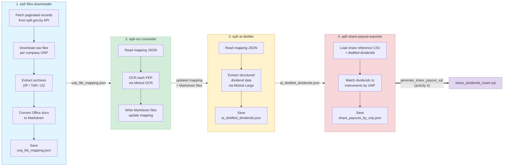

# workflows

[](https://codecov.io/gh/Red-Panda-Dev/workflows)

**Open-source solution for collecting dividend disclosure information about Belarusian shares.**

Built on [Mistral AI Workflows](https://docs.mistral.ai/workflows/getting-started/introduction) and powered by [Mistral AI models](https://docs.mistral.ai/getting-started/models/models_overview/) — this project automates the entire pipeline from downloading raw disclosure records from the Belarusian regulator to producing structured, machine-readable dividend data.

Developed by the [TokenBel](https://tokenbel.info/) team — check out the [Belarusian shares dashboard](https://dashboard.tokenbel.info/shares/) powered by this data.

| Project | Source | Pipeline |
|---------|--------|----------|
| **epfr-downloader** | [epfr.gov.by](https://epfr.gov.by) REST API | Paginate records → download files by UNP → extract/convert/OCR → AI-distill → export share payouts → produce mapping JSON |

- **Language:** Python 3.14.3
- **Package manager:** [uv](https://github.com/astral-sh/uv)
- **Linting/formatting:** [ruff](https://docs.astral.sh/ruff/)
- **Type checking:** [ty](https://github.com/astral-sh/ty)

## Business logic

The pipeline automates the retrieval and enrichment of dividend disclosure filings published by the Belarusian securities regulator (EPFR). Each disclosure record describes a dividend event — who is paying, which share class, what amount, and over what period. The raw data arrives as heterogeneous binary files (PDFs, Office documents, archives) uploaded by issuers to the EPFR portal. The pipeline normalizes everything into structured JSON that can be loaded into the TokenBel dashboard or any downstream database.

### Data flow

```
epfr.gov.by API
    │
    ▼
output/<UNP>/*.{pdf,docx,xlsx,doc,xls,...}     ← raw downloaded files
    │
    ▼
output/unp_file_mapping.json                    ← file lineage index (archive → extracted → converted)
    │
    ▼
output/<UNP>/*.md                               ← all documents normalized to Markdown
    │
    ▼
output/ai_distilled_dividends.json              ← structured dividend records per company/file
    │
    ▼
output/share_payouts_by_unp.json                ← matched payout records (UNP + share kind → instrument)
    │
    ▼
output/share_dividends_insert.sql               ← SQL INSERT statements (in-workflow: generate_share_payout_sql activity)
```

### Key data artifacts

| Artifact | Produced by | Description |
|----------|-------------|-------------|
| `output/<UNP>/*` | `epfr-files-downloader` | Raw files downloaded from EPFR, organized by company tax ID (UNP) |
| `unp_file_mapping.json` | `epfr-files-downloader` | Maps every UNP to its disclosure files with full transformation lineage (`extracted_from`, `converted_from`) |
| `*.md` (per UNP folder) | `epfr-ocr-converter` | All documents (including PDFs) converted to clean Markdown |
| `ai_distilled_dividends.json` | `epfr-ai-distiller` | Structured dividend data: issuer, share class, amount per share, total amount, record date, payment period |
| `share_payouts_by_unp.json` | `epfr-share-payout-exporter` | Dividend payouts matched against share reference CSV, keyed by UNP |
| `share_dividends_insert.sql` | `epfr-share-payout-exporter` (activity `generate_share_payout_sql`) | Ready-to-load SQL INSERT statements for downstream databases |

## Pipeline flow



Each workflow is **independently invocable** — they communicate only through filesystem artifacts (JSON, Markdown) and never import each other directly. This allows separate execution, different retry policies, and phased processing.

## Quick Start

### Prerequisites

- Python 3.14.3
- [uv](https://github.com/astral-sh/uv)
- `MISTRAL_API_KEY`

### Setup

```bash
git clone <repo-url> && cd workflows
cd epfr-downloader && uv sync
```

Create `epfr-downloader/.env`:

```bash
cp epfr-downloader/.env.example epfr-downloader/.env
```

See `epfr-downloader/.env.example` for all available configuration options.

### Run worker and execute

```bash
# Terminal 1: start worker
cd epfr-downloader && make start-worker

# Terminal 2: trigger main pipeline
cd epfr-downloader && make execute input='{"max_pages": 2, "date_from": "2026-03-01"}'

# Terminal 2: trigger share payout export (after distillation)
cd epfr-downloader && make execute-share-payout-exporter input='{"output_dir": "output"}'
```

### Run with Docker

Build and run the EPFR workflow worker container from `epfr-downloader/`:

```bash
cd epfr-downloader
make docker-build
make docker-run
```

The container mounts a volume from host `epfr-downloader/output` to container `/app/output`:

- Host: `$(pwd)/output`
- Container: `/app/output`

This volume stores downloaded files and generated JSON outputs outside the container filesystem.

If you need to restart the worker container:

```bash
docker rm -f epfr-worker
cd epfr-downloader && make docker-run
```

## Workflow details

### 1. `epfr-files-downloader`

Fetches paginated disclosure records from the EPFR REST API, downloads raw binary files organized by company UNP (tax ID), detects file types via magic bytes (the API returns raw content with no filenames), extracts archives, converts Office documents (docx/doc/xls/xlsx) to Markdown, and writes `unp_file_mapping.json` with full file lineage tracking.

| Stage | Activity | Description |
|-------|----------|-------------|
| Fetch | `fetch_all_pages` | Paginate EPFR API (0-based) until `last=True` or `max_pages` reached |
| Download | `download_all_epfr_files` | Streaming download with retry, files saved as `<record_id><detected_ext>` |
| Extract | `extract_all_epfr_archives` | ZIP/TAR/GZ extraction, OOXML-in-ZIP detection and rename |
| Convert | `convert_all_epfr_files` | Office docs → Markdown, `.doc` fallback chain (python-docx → docx2txt → antiword) |
| Map | `save_unp_mapping` | Atomic write of mapping JSON with transformation chain per file |

### 2. `epfr-ocr-converter`

Reads the mapping JSON, OCRs each PDF entry via Mistral OCR API, writes Markdown output, and updates mapping entries to reference the `.md` files. Supports optional cleanup of source PDFs after successful conversion. Concurrency-limited to 2 parallel OCR requests.

### 3. `epfr-ai-distiller`

Reads the mapping JSON and processes each Markdown file through Mistral Large for structured dividend extraction. Produces `ai_distilled_dividends.json` with per-company, per-file dividend data including amounts, dates, share classes, and payment periods. Tracks `autofilled_fields` for downstream quality review. Sequential processing with configurable delays to avoid rate limits.

### 4. `epfr-share-payout-exporter`

Joins `ai_distilled_dividends.json` with a share reference CSV (`shares_source_data.csv`) to match dividend records to specific financial instruments by UNP and share kind. Skips ambiguous, autofilled, and file-error entries. Produces `share_payouts_by_unp.json` with DB-ready payout records and detailed match statistics.

### SQL generation (`generate_share_payout_sql` activity)

The exporter's 4th activity, `generate_share_payout_sql`, runs **inside** the `epfr-share-payout-exporter` workflow. It reads the just-written `share_payouts_by_unp.json` and emits `share_dividends_insert.sql` — ready-to-load SQL INSERT statements. The old standalone `generate_sql.py` has been removed.

## Validation

```bash
# From repo root
make lint
make refactor
make type-check

# From epfr-downloader/
make lint
make test
```

## Docs

- `ARCHITECTURE.md` — system map, data flow, and invariants
- `AGENTS.md` — contributor guidance
- `epfr-downloader/AGENTS.md` — project-local module map and change rules
- `epfr-downloader/src/workflows/epfr/AGENTS.md` — pipeline internals, data contracts, activity boundaries
